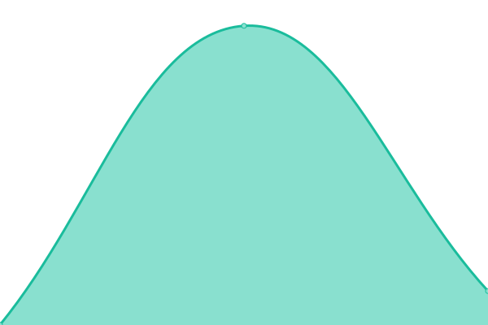
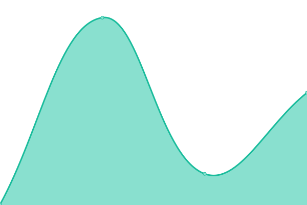

# [📈 Live Status](https://status.alvarotc.com): <!--live status--> **🟧 Partial outage**

This repository contains the open-source uptime monitor and status page for [Alvaro Torres Carrasco](https://alvarotc.com), powered by [Upptime](https://github.com/upptime/upptime).

With [Upptime](https://upptime.js.org), you can get your own unlimited and free uptime monitor and status page, powered entirely by a GitHub repository. We use [Issues](https://github.com/alvarotorresc/upptime/issues) as incident reports, [Actions](https://github.com/alvarotorresc/upptime/actions) as uptime monitors, and [Pages](https://status.alvarotc.com) for the status page.

<!--start: status pages-->
<!-- This summary is generated by Upptime (https://github.com/upptime/upptime) -->
<!-- Do not edit this manually, your changes will be overwritten -->
<!-- prettier-ignore -->
| URL | Status | History | Response Time | Uptime |
| --- | ------ | ------- | ------------- | ------ |
|  [Quedamos (Web)](https://quedamos-app-mobile.vercel.app) | 🟩 Up | [quedamos-web.yml](https://github.com/alvarotorresc/upptime/commits/HEAD/history/quedamos-web.yml) | 

 144ms
     
 | 

<a href="https://status.alvarotc.com/history/quedamos-web">100.00%</a>
    

|  [Quedamos (API)](https://quedamos.api.alvarotc.com/health) | 🟩 Up | [quedamos-api.yml](https://github.com/alvarotorresc/upptime/commits/HEAD/history/quedamos-api.yml) | 

 441ms
     
 | 

<a href="https://status.alvarotc.com/history/quedamos-api">100.00%</a>
    

|  [alvarotc.com](https://alvarotc.com) | 🟩 Up | [alvarotc-com.yml](https://github.com/alvarotorresc/upptime/commits/HEAD/history/alvarotc-com.yml) | 

 245ms
     
 | 

<a href="https://status.alvarotc.com/history/alvarotc-com">100.00%</a>
    

|  [Aux](https://aux.alvarotc.com) | 🟩 Up | [aux.yml](https://github.com/alvarotorresc/upptime/commits/HEAD/history/aux.yml) | 

 800ms
     
 | 

<a href="https://status.alvarotc.com/history/aux">100.00%</a>
    

|  [DevTools](https://devtools.alvarotc.com) | 🟩 Up | [dev-tools.yml](https://github.com/alvarotorresc/upptime/commits/HEAD/history/dev-tools.yml) | 

 279ms
     
 | 

<a href="https://status.alvarotc.com/history/dev-tools">100.00%</a>
    

|  [PokeUtils](https://pokeutils.alvarotc.com) | 🟩 Up | [poke-utils.yml](https://github.com/alvarotorresc/upptime/commits/HEAD/history/poke-utils.yml) | 

 269ms
     
 | 

<a href="https://status.alvarotc.com/history/poke-utils">100.00%</a>
    

|  [Test Down](https://alvarotc.com/this-does-not-exist) | 🟥 Down | [test-down.yml](https://github.com/alvarotorresc/upptime/commits/HEAD/history/test-down.yml) | 

 229ms
     
 | 

<a href="https://status.alvarotc.com/history/test-down">3.74%</a>
    

<!--end: status pages-->

[**Visit our status website →**](https://status.alvarotc.com)

## 📄 License

- Powered by: [Upptime](https://github.com/upptime/upptime)
- Code: [MIT](./LICENSE) © [Anand Chowdhary](https://anandchowdhary.com), supported by [Pabio](https://pabio.com)
- Data in the `./history` directory: [Open Database License](https://opendatacommons.org/licenses/odbl/1-0/)
